# Dreaming Masks with FLUX.1 Kontext

Date: 23/09/2025

<aside>
💡 Using FLUX.1 Kontext for creating segmentation masks for objects absent from images, enabling workflows in inpainting and virtual try-ons.

</aside>

## **Project Description**

Image segmentation is a very challenging task. Over the years, many image segmentation models have been implemented to tackle it, including models such as YOLO, SAM / SAM2, Sapiens, and even promptable pipelines like GroundingDino + SAM / SAM2. While effective in certain settings, these methods often struggle with out-of-distribution samples and unreliable results if complex masks are necessary, they are difficult to prompt (e.g. you have to provide points or bounding boxes), and more critically, they cannot generate masks for objects that ***don’t*** exist in the given image. For example, consider the scenario of putting glasses on a model who is not wearing any glasses. Before even thinking about inpainting the glasses, the first step is to generate a mask that defines exactly where the glasses should appear. With current segmentation models, this is nearly impossible to automate reliably. Another example is putting long socks on a model that is wearing short socks. With current segmentation models, one would have to cobble together several different masks (i.e. short sock mask + calf mask - (optionally) a shoe mask), and then attempt to merge them using a mix of post-processing tricks like mask dilation or filling in holes. In short, existing segmentation models fall short because they only identify what’s already in the image - like the motto says: “Getting blood out from a stone is impossible” - until now!

To address these challenges, our proof-of-concept leverages FLUX.1 Kontext. Instead of relying on fixed segmentation models, we train multiple lightweight LoRAs to generate complex segmentation masks even for objects absent from the original image. Each LoRA is tailored to generate one specific **type** of mask. For example, a dedicated LoRA can be trained to segment a **long sock** region (defined as the area below the knee, excluding parts from clothing and shoes). Additionally, we have found that as few as 10 training samples are sufficient for FLUX.1 Kontext to learn the mask and produce highly consistent results. Our approach generalizes well and achieves strong results on out-of-sample data, opening the door to new workflows in tasks like inpainting and virtual try-on. Honestly, the final results blew us away!

But first things first …

**Motivation: Using Generative AI in Virtual Try-On Tasks**

Virtual try-on tasks focus on transferring clothing items - such as t-shirts, socks, bras, or trousers - from  **flatlay images** (i.e. images that show the product itself; usually on a white background) onto **on-model images** (i.e. images that show a model wearing a specific outfit from a specific brand; usually either on a neutral background such as white or gray-ish or as a mood where the model is placed in an appealing setting). Latter can also be AI-generated.  Technically, the workflow always requires (a) a flatlay image and (b) a reference on-model image (see examples below). The workflow then proceeds as follows:

1. Extract a mask around the target area in the reference on-model image that is to be modified (for example, isolating the black trousers worn by the model).
2. Supply both the flatlay image (e.g., displaying leo trousers) and the reference on-model image, along with its corresponding mask from step 1, to a specialized virtual try-on model - for instance, [catvton](https://github.com/nftblackmagic/catvton-flux)
3. Ask the specialized virtual try-on model to replace the outfit in the on-model image (e.g. the black trousers) highlighted by the mask from step 1 with the product from the flatlay image (e.g. the leo trousers). See results below.

| Flatlay Image | Reference On-Model Image | Generated On-Model Image |
|---|---|---|
| 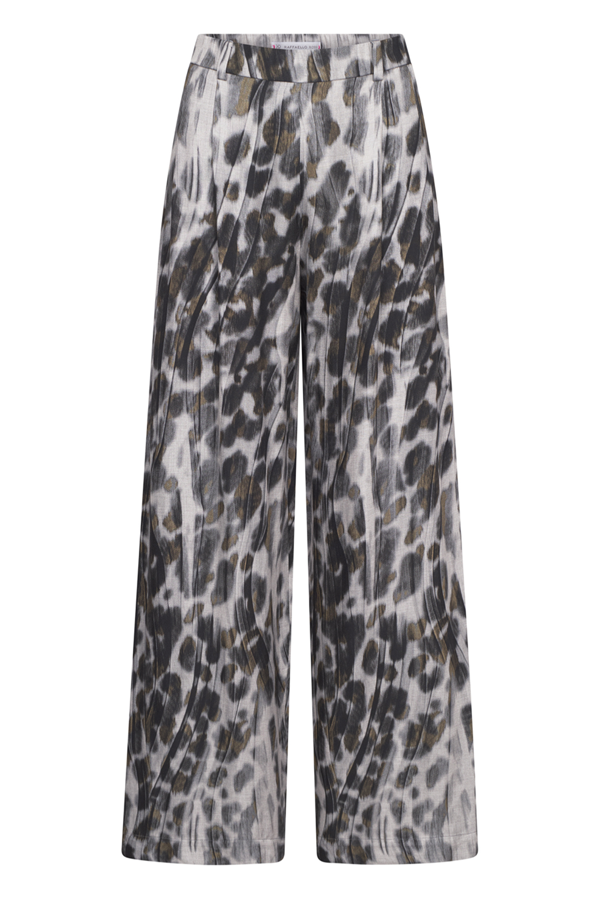 | 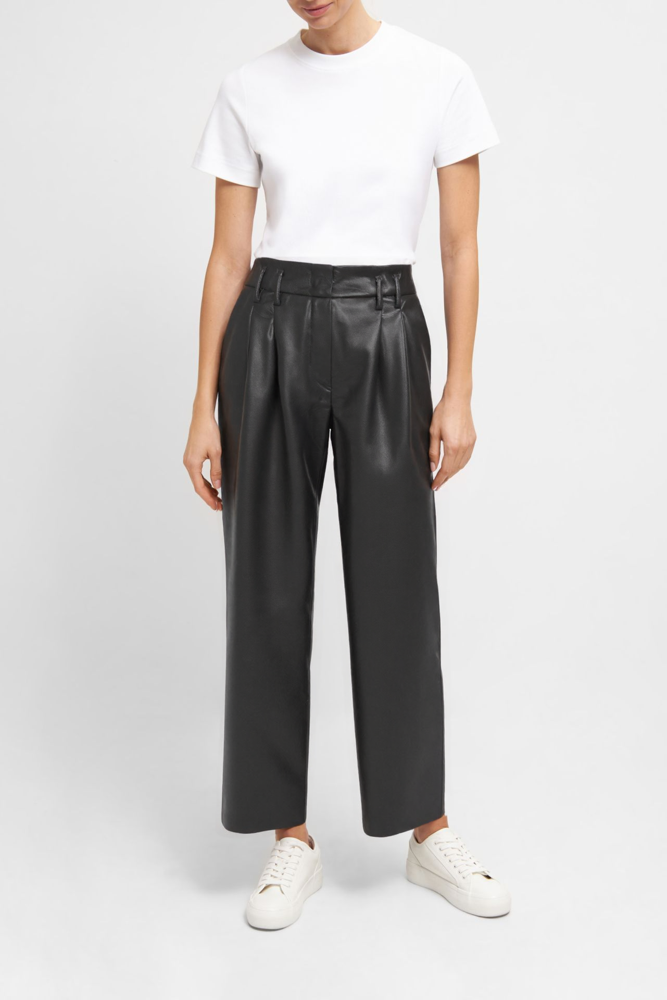 | 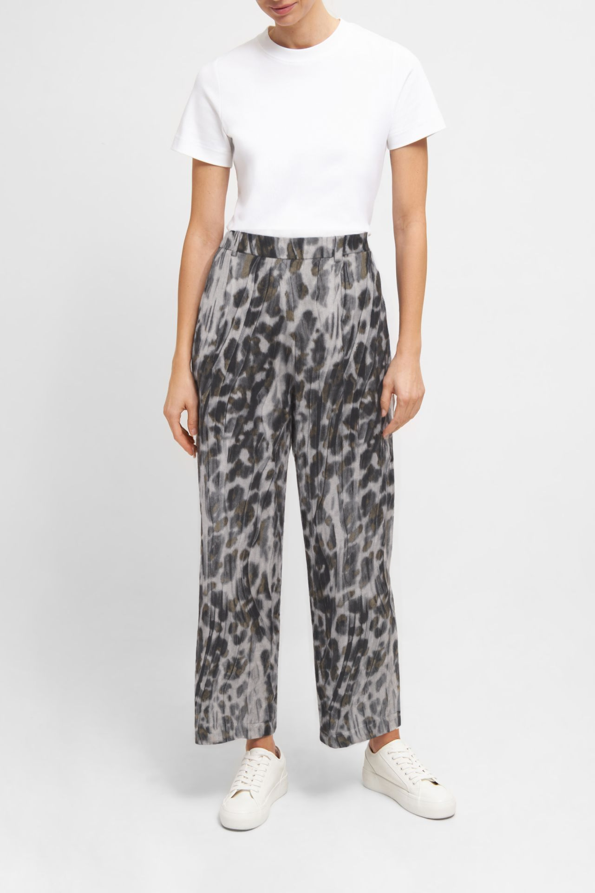 |

One notoriously difficult but very important step in this process is *automatically constructing* the *correct* mask for the area to be modified (step 1). Traditional image segmentation models can only outline objects already present; they cannot accurately predict a mask for new or complex items. For example, changing short socks to long socks in a given image requires the segmentation model to mask the foot, the sock, and the calves; another example is replacing a t-shirt with a hoodie, where additionally to the t-shirt we have to mask the upper and lower arms of the model in the on-model image. See examples below.

Typical limitations of current segmentation models:

1. It’s impossible to mask an object that is not present in the given image (e.g. glasses when the model is not wearing any glasses yet)
2. It’s really hard to construct complex masks because of the limited knowledge of objects in a given image (e.g., a long sock mask that is necessary to replace no socks / short socks with long socks)
    * For example, SAM2 is really good in identifying a person as a whole but getting a mask let’s say only for the calves is really difficult (you can try to use a bounding box but even that comes with some limitations; where do the points from the bounding box come from?)
3. Most of the segmentation models struggle with out-of-distribution samples. For example, Sapiens is really good in identifying different parts of the human body + different clothing types. But as soon as we only see a part of the human body (e.g. lower legs), Sapiens fails to recognize the different body parts and clothing types.

| 1. Problem | 2. Problem |
|---|---|
| 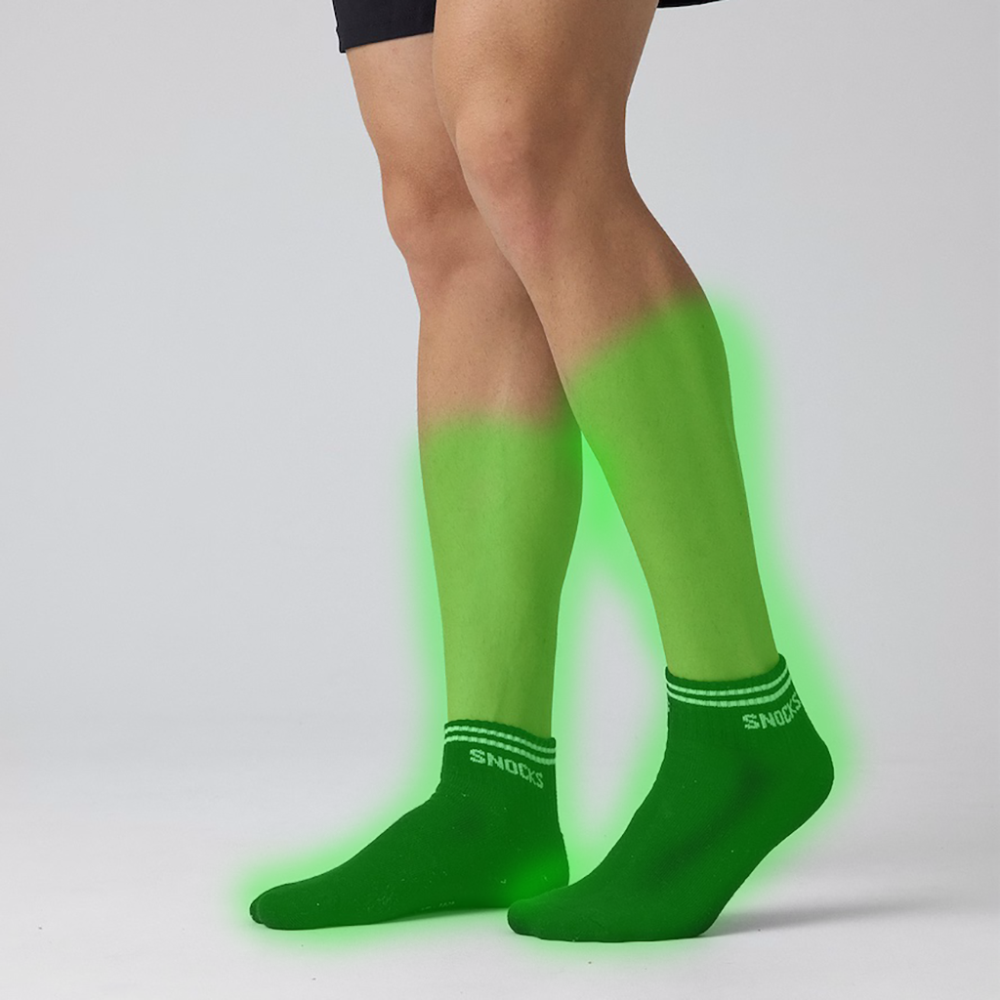 | 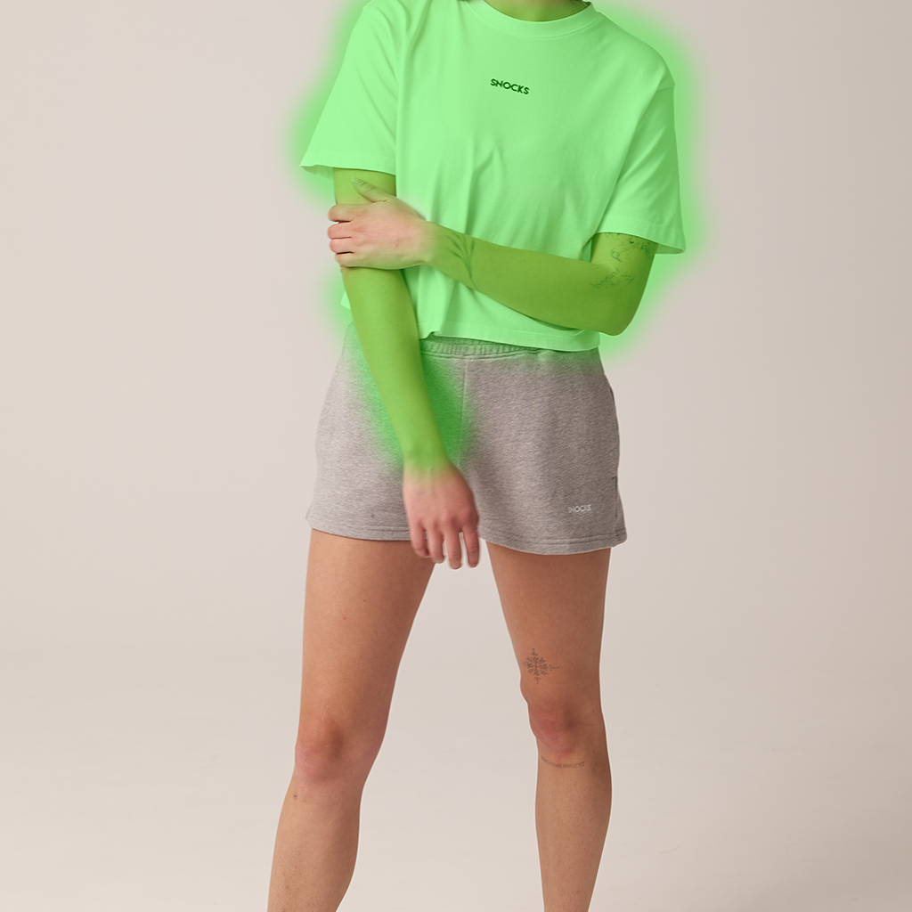 |
| How can we automatically built such a complex mask (green area in the image)? | How can we automatically built such a complex mask (green area in the image)? | 

## **Goal**

---

To tackle this problem, the idea is to train multiple, lightweight FLUX.1 Kontext LoRAs that are capable of generating complex segmentation masks even for objects absent from the original image. Each LoRA is tailored to generate one specific **type** of mask. For example, a dedicated LoRA can be trained to segment a **long sock** region (defined as the area below the knee, excluding parts from clothing and shoes).

### Process

We used Ostris’ AI Toolkit to train the FLUX.1 Kontext LoRAs. You can access it via [HuggingFace](https://huggingface.co/spaces/multimodalart/ai-toolkit) or launch a RunPod [Template](https://console.runpod.io/hub/template/ai-toolkit-ostris-ui-official?id=0fqzfjy6f3). Basically, we followed the instructions in this [video](https://www.youtube.com/watch?v=WSWubJ4eFqI). Settings different from default:

- Prompt / Caption: “put a green mask for [OBJECT] on the person”, where [OBJECT] refers to the area-of-interest (e.g. glasses, socks). We added the caption to each target image.
- Linear Rank: 64
- Steps: 1000-2000
- Resolutions: [512,768,1024]

Overall, we trained 4 different LoRAs that can be used in virtual try-on tasks, namely: *Socks-LoRA, Hat-LoRA, Glasses-LoRA, and Sweatshirt-LoRA*. For each of these LoRAs, we collected ~10 training samples in the form of (a) a control image; image that serves as a starting point for FLUX.1 Kontext and (b) the target image; image that contains a green mask for the to-be modified area. Note that we created these masks manually using Photoshop. For some examples, see below.

| Control | Target |
|---|---|
|  |  |
| 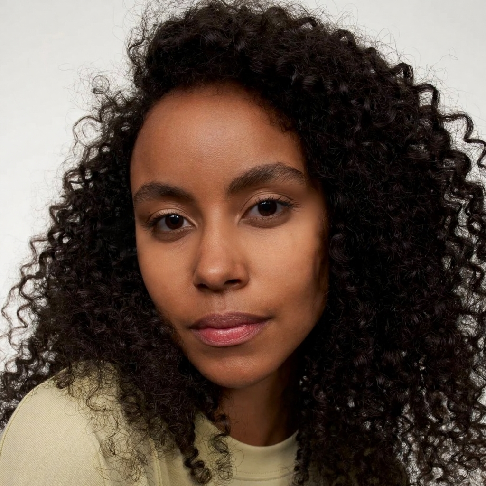 | 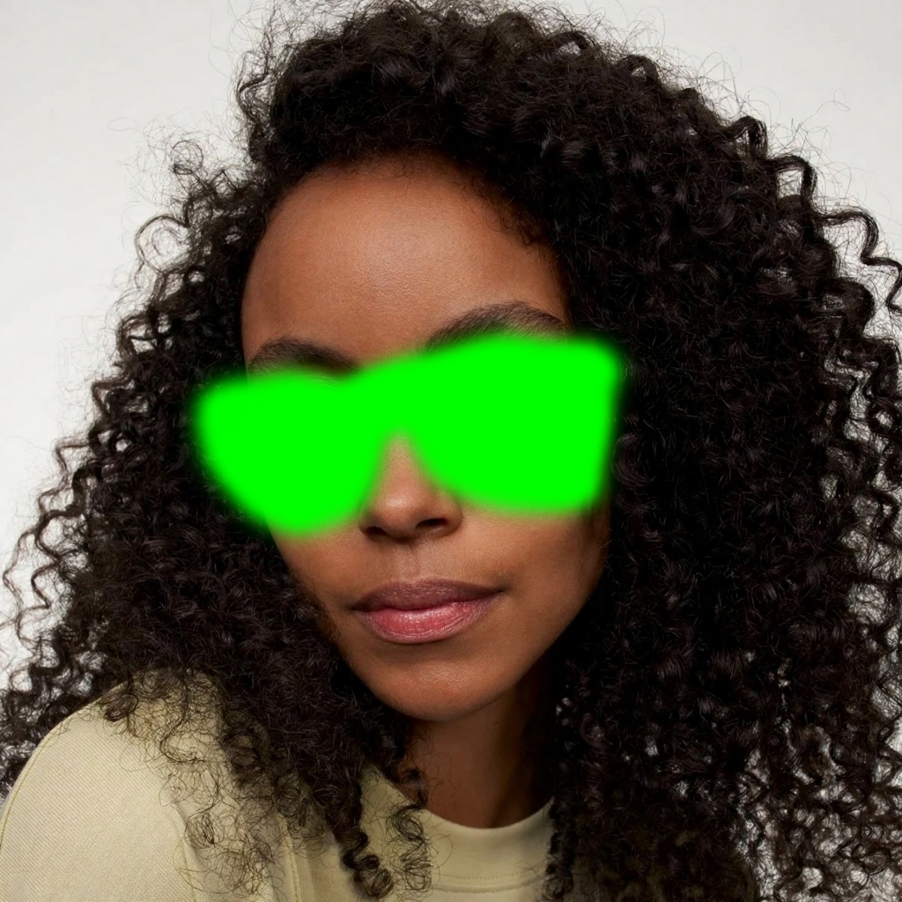 |
| 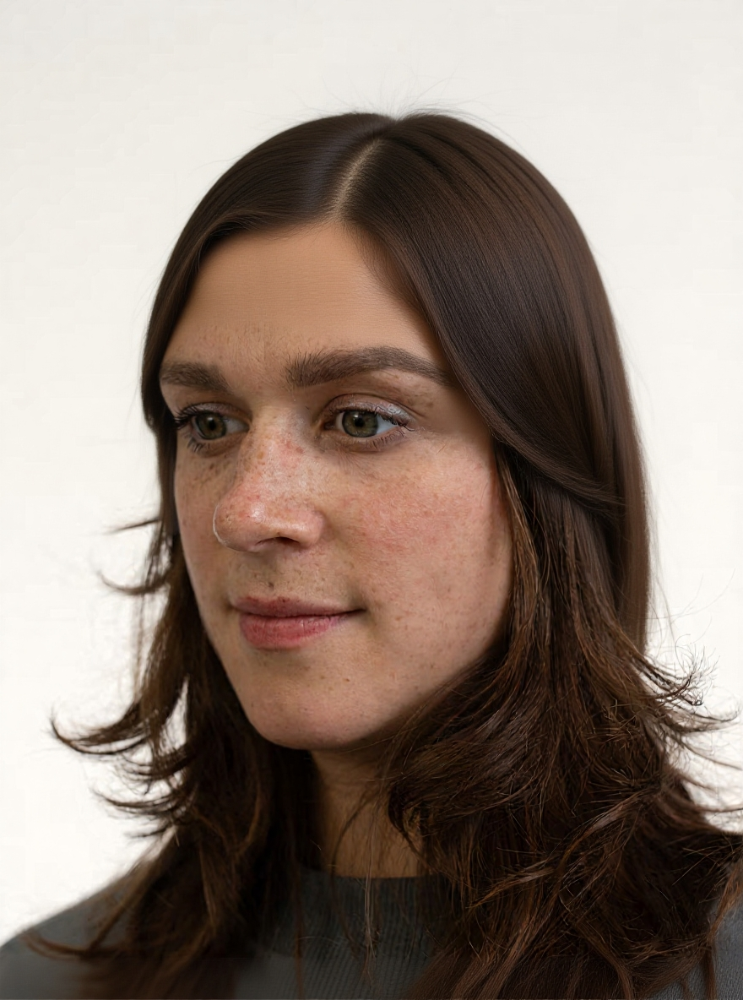 | 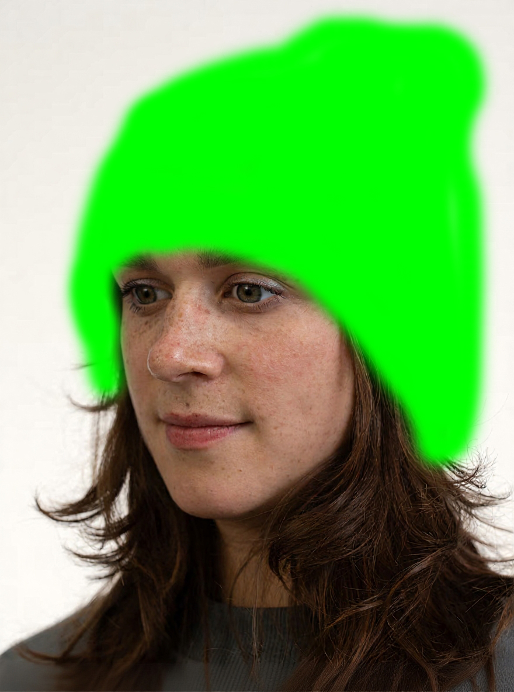 |
| 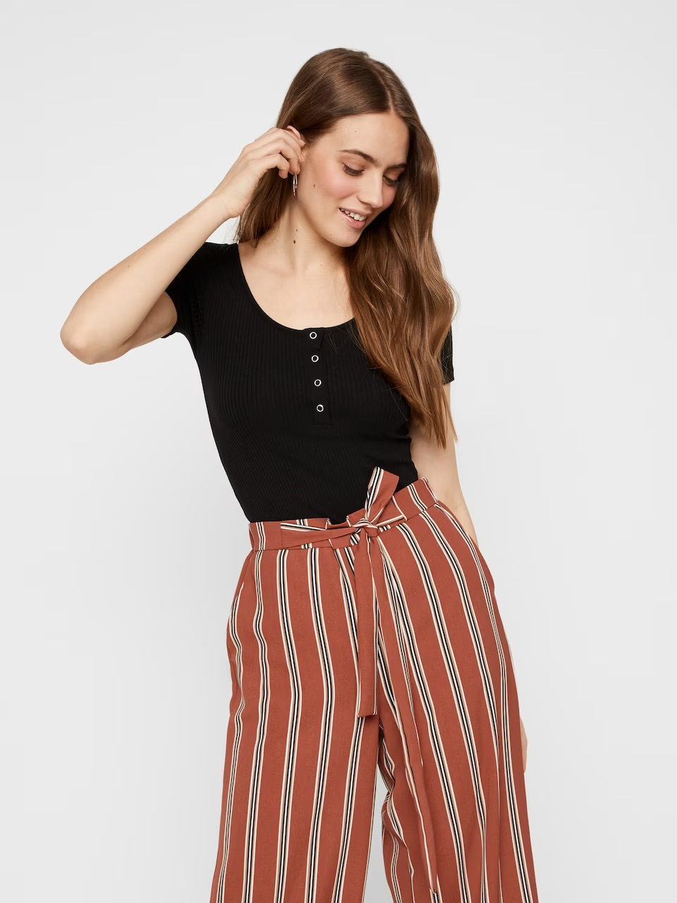 | 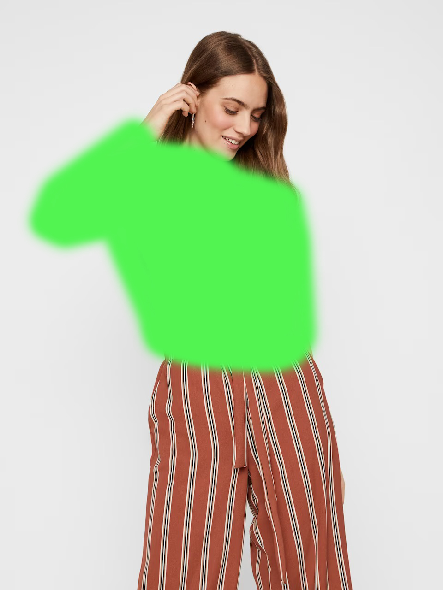 |

You can find the training (control + target images) and testing (+ results) data here:

- *Socks-LoRA. [Link](https://pixit-my.sharepoint.com/:f:/g/personal/nils_pixitai_io/EmKdXUKZDDxNr4ftJ1Ibz68BSGgtH31rsobq_LvpTJy0HA?e=SbWlS1)*
    - Prompt / Caption: put a green mask for socks and lower leg skin on the person
- *Hat-LoRA. [Link](https://pixit-my.sharepoint.com/:f:/g/personal/nils_pixitai_io/EsfB9MpHNCNIskJxw054iN8BW_1cMI5_giPROO-D-X4XnA?e=U0sHsP)*
    - Prompt / Caption: ??? TODO
- *Glasses-LoRA. [Link](https://pixit-my.sharepoint.com/:f:/g/personal/nils_pixitai_io/Enq6VV-jN9pJpIdhXeIkYxMB2Adg5udUm_KtwSgwne6iNQ?e=hXkcg7)*
    - Prompt / Caption: put a green mask for glasses on the person
- *Sweatshirt-LoRA. [Link](https://pixit-my.sharepoint.com/:f:/g/personal/nils_pixitai_io/EnzB-Fzb219ArVDaoDo570EB9ixVsO0hfwzdpcK4YT3F9Q?e=cCgkNX)*
    - Prompt / Caption: put a green mask for a sweatshirt on the person

**Notes on the training data**

- Select reference on-model images that represent your target distribution in terms of size, shape, perspective, crop etc.
- Before creating your masks, ask yourself: What does the ideal mask look like? For example in the socks case, we first assumed that we were given only barefoot models but later we changed that to barefoot models, models wearings shoes, models wearing short socks, models wearing long socks etc.

## Results

---

You can find the final LoRAs (saved at different steps; 1000 steps was usually enough) here:

- *Socks-LoRAs*. [Link](https://pixit-my.sharepoint.com/:f:/g/personal/nils_pixitai_io/Emnu_rjtNgVBjhPYuy3pOtwBzMCfQA3DgxUDigCkiIP8bg?e=Hn6KPW)
- *Hat-LoRAs.* [Link](https://pixit-my.sharepoint.com/:f:/g/personal/nils_pixitai_io/EgN-X5Zx7OtLpuWroZca9IUBBJLY4A7TwZSRXff6cgsBXg?e=NQS6Cf)
- *Glasses-LoRAs.* [Link](https://pixit-my.sharepoint.com/:f:/g/personal/nils_pixitai_io/EmCDqdqT88pClUhj5i9_0RABnQB8-FkwBLktjK7UZYxT_A?e=H8RDcf)
- *Sweatshirt-LoRAs.* [Link](https://pixit-my.sharepoint.com/:f:/g/personal/nils_pixitai_io/Eis7dBOMcXlNmoj7orw3NWkB3vFNnRYl1Us8IVyEEBedpw?e=Y8fFug)

We (visually) evaluated the performance of each LoRA on 4-5 different testing images and the results are just mind-blowing. See yourself:

### Socks-LoRA

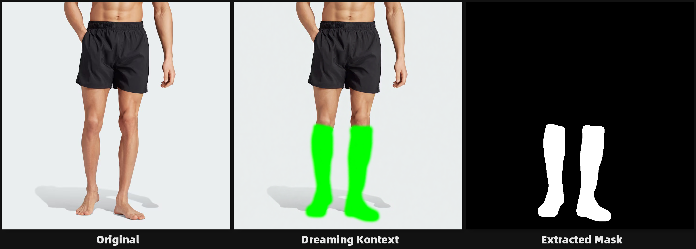

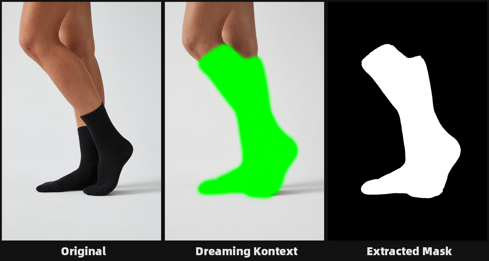

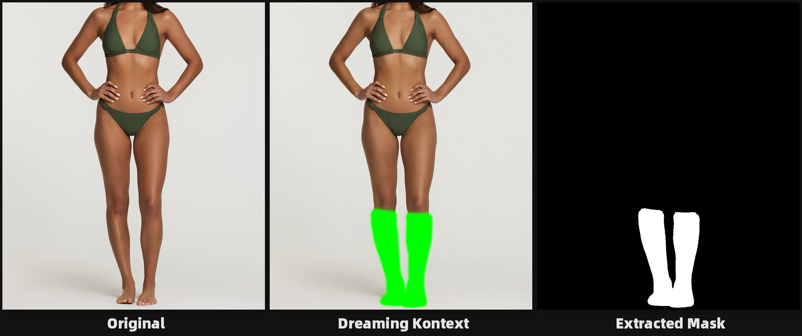

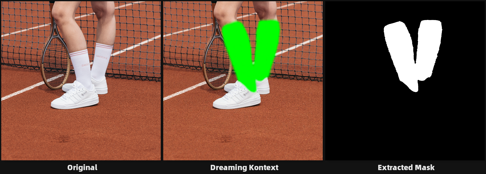

### Hats-LoRA

### Glasses-LoRA

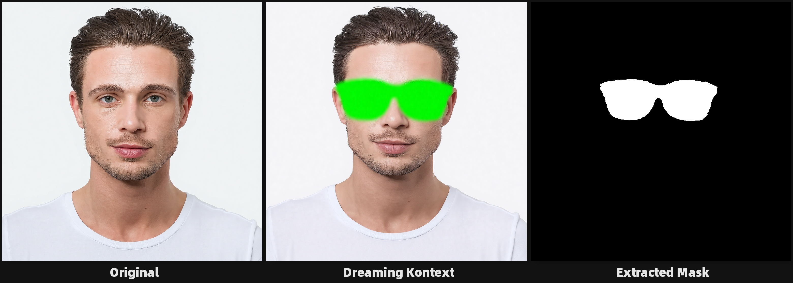

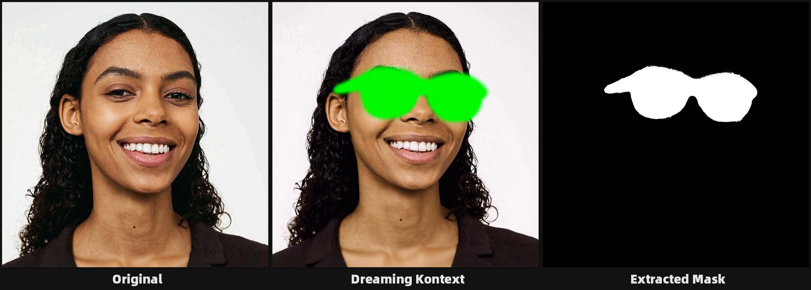

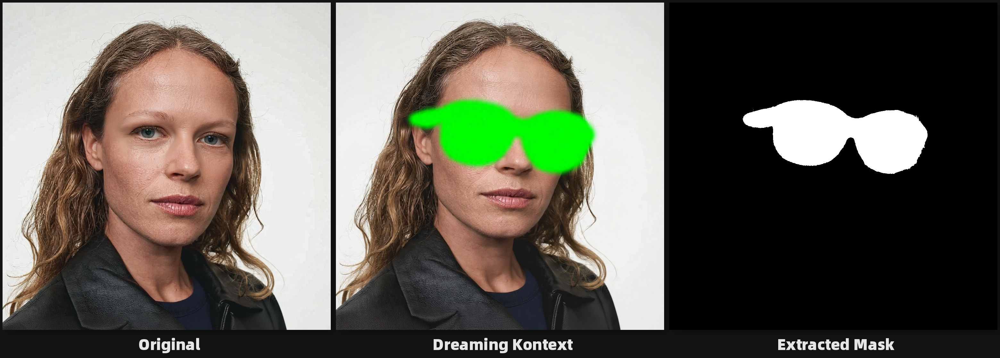

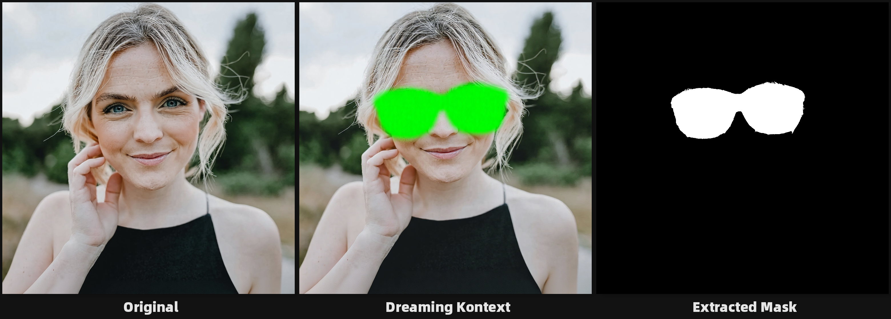

### Sweatshirt-LoRA

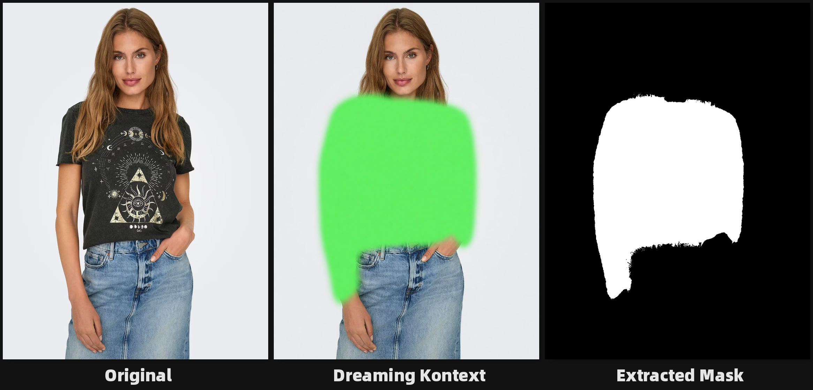

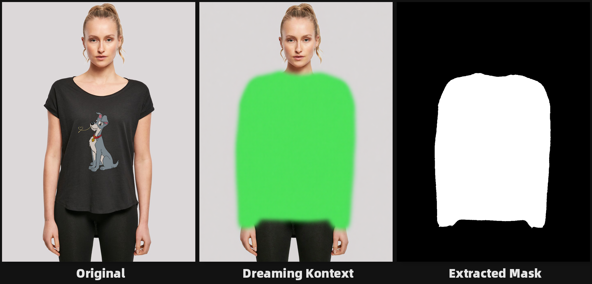

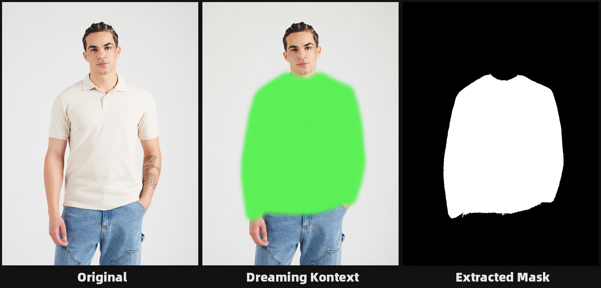

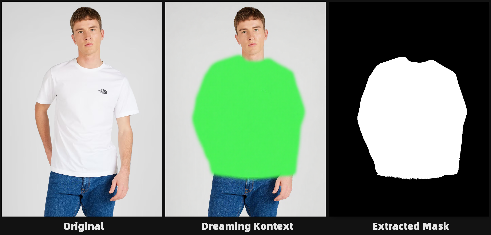

## Inference

---

We provide a ComfyUI workflow that can be used to extract the mask from the given FLUX.1 Kontext prediction. The green nodes are adjustable. Everything else should stay the same.

[flux-kontext-segmentation.json](https://pixit-my.sharepoint.com/:u:/g/personal/nils_pixitai_io/EY1z5Bl6kxVBhaF5vDr-_WsBl0XbNqKhtQuK11eaMaO1Fw?e=FUiKtZ)